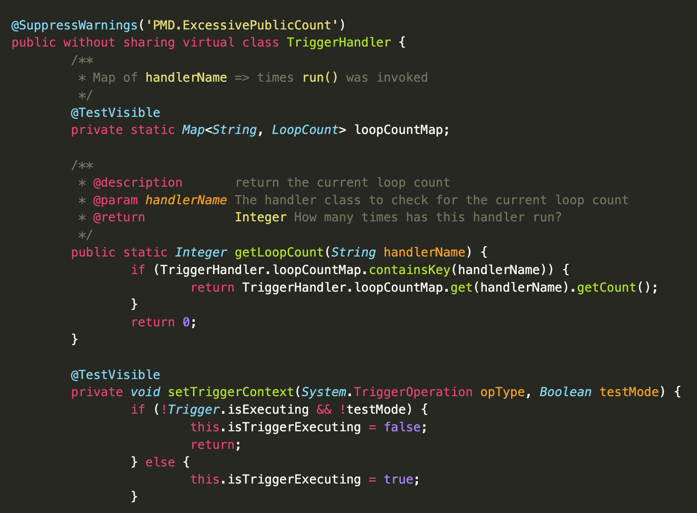

# Apex - a language grammar for the [Salesforce Platform](https://developer.salesforce.com)

[](https://www.npmjs.com/package/highlightjs-apex)


[](https://www.npmjs.com/package/highlightjs-apex)
[](https://www.npmjs.com/package/highlightjs-apex)

[](https://github.com/highlightjs/highlightjs-apex/blob/main/LICENSE.md)
[](https://cdn.jsdelivr.net/npm/highlightjs-apex/dist/apex.min.js)

<!-- [](https://www.jsdelivr.com/package/gh/highlightjs/highlightjs-apex) -->

[](https://github.com/highlightjs/highlightjs-apex/issues)

## Demo

The screenshot was captured from a webpage using `apex.min.js` from the `dist` folder and the main `highlight.min.js` library.
(Code is from [Salesforce Trigger Framework](https://dschach.github.io/salesforce-trigger-framework/))

Feel free to use any css library you'd like!

## Apex code requirements

This library will highlight Apex as used in Apex classes and triggers.

## SOQL requirements

To highlight a SOQL query, it MUST be enclosed in square brackets (`[` and `]`). While creating a SOQL parser as a standalone sub-language (like javascript in html/Visualforce) would be ideal, this would require users to install both packages in a project and would get too messy. Each language can contain the other, so dependencies in the parsing become unwieldy.

## Usage

Simply include the Highlight.js library in your webpage or Node app, then load this module. For more complex usage, see [highlight.js usage](https://github.com/highlightjs/highlight.js#basic-usage).

### Static website or simple usage

Simply load this module after loading Highlight.js. You'll use the minified version found in the `dist` directory. This module is just a CDN build of the language, so it will register itself as the Javascript is loaded.

For more details see [Highlight.js main page](https://github.com/highlightjs/highlight.js#highlightjs).

```html
<script type="text/javascript" src="/path/to/highlight.min.js"></script>
<script type="text/javascript" src="/path/to/apex.min.js"></script>
<!-- <link rel="stylesheet" href="https://unpkg.com/highlightjs/styles/vs.css" /> -->
<!-- Use any stylesheet you'd like - though Apex developers may want to use the custom theme based on MavensMate's Monokai -->
<link
	rel="stylesheet"
	href="https://cdn.jsdelivr.net/npm/highlightjs-apex/src/styles/monokai-sublime-apex.css" />

<script type="text/javascript">
	hljs.highlightAll();
</script>
```

This will find and highlight code inside of `<pre><code>` tags; it tries to detect the language automatically. If automatic detection doesn’t work for you, you can specify the language in the `class` attribute:

```html
<pre>
    <code class="language-apex">
    ...
    </code>
</pre>
```

#### Ignoring a Code Block

To skip highlighting of a code block completely, use the `nohighlight` class:

```html
<pre><code class="nohighlight">...</code></pre>
```

### Using directly from jsDelivr

```html
<script src="https://cdn.jsdelivr.net/gh/highlightjs/cdn-release/build/highlight.min.js"></script>
<script
	type="text/javascript"
	src="https://cdn.jsdelivr.net/npm/highlightjs-apex/dist/apex.min.js"></script>
```

- More info: <https://www.jsdelivr.com/>

### Using directly from the unpkg CDN

```html
<script src="https://unpkg.com/@highlightjs/cdn-assets@11.9.0/highlight.min.js"></script>
<script
	type="text/javascript"
	src="https://unpkg.com/highlightjs-apex/dist/apex.min.js"></script>
```

- More info: <https://unpkg.com/>

### With Node or another build system

If you're using Node / Webpack / Rollup / Browserify, etc, simply require the language module, then register it with Highlight.js.

```javascript
var hljs = require('highlightjs');
var hljsApex = require('highlightjs-apex');

hljs.registerLanguage('apex', hljsApex);
hljs.highlightAll();
```

### Styles

There are many styles to choose from at [https://highlightjs.org/demo](https://highlightjs.org/demo). They can be downloaded from [the GitHub repository](https://github.com/highlightjs/highlight.js/tree/main/src/styles) and referenced from unpkg.com (see sample html above).
A great stylesheet for Apex is in this repo in the [styles folder](https://github.com/highlightjs/highlightjs-apex/tree/main/src/styles).

## License

Highlight.js is released under the BSD 3-Clause License. See [LICENSE](https://github.com/highlightjs/highlight.js/blob/main/LICENSE) file for details.
Highlightjs-apex is released under the MIT License. See [LICENSE](/LICENSE.md) file for details.

## Author

David Schach [https://github.com/dschach](https://github.com/dschach)

## Contribution

Feel free to create issues or (even better) pull requests.

## Links

- The official site for the Highlight.js library is <https://highlightjs.org/>.
- The Highlight.js GitHub project: <https://github.com/highlightjs/highlight.js>
- Learn more about Apex: <https://developer.salesforce.com/docs/atlas.en-us.apexcode.meta/apexcode/apex_intro_what_is_apex.htm>
